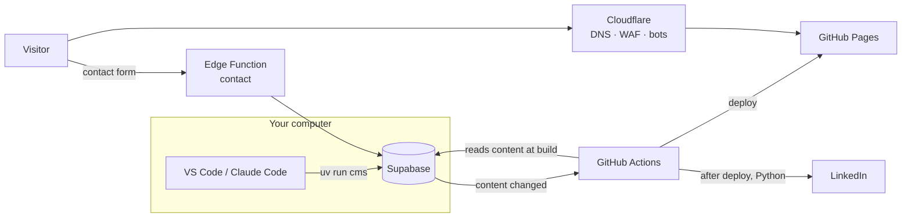

# carlos.nz

The personal portfolio of Carlos: who I am, my experience, what I'm studying and testing in my homelab, posts shared on LinkedIn, and a contact form. The visual design follows the "Warm Tech Leadership" system created in Google Stitch.

**Stack:** Astro (static site) · Tailwind CSS 4 · Supabase (Postgres + one Edge Function) · **Python CLI `cms`** for everyday operations · GitHub Pages + GitHub Actions · Cloudflare (DNS, security, Turnstile) · LinkedIn Posts API.

All content, documentation and code comments are written in New Zealand English.

## How it works



Three decisions explain almost everything:

1. **The browser never talks to the database.** Content is read only at build time, with the secret key stored in GitHub. Supabase's public key has no permissions at all, so there is no public data API to scrape.
2. **Publishing is editing the database.** Any change to posts, labs, profile or experience makes the database ask GitHub Actions for a rebuild. A few minutes later the site is updated, and new posts are shared on LinkedIn.
3. **Privacy by default.** No cookies, no analytics, no Google Fonts. The contact form keeps the minimum, and messages are deleted after 12 months.

**Who does what:** Astro builds the pages (`src/`). The Python package `carlos_cms` is everything you run day to day: posts, labs, site text, images, LinkedIn, GitHub sync. The only server code is the contact-form Edge Function (TypeScript, `supabase/functions/contact`).

## Run it locally

You need [Node.js 22+](https://nodejs.org) and [uv](https://docs.astral.sh/uv/getting-started/installation/) (it installs the right Python version for you).

```bash
npm install          # the website
uv sync              # the Python CLI and its dependencies (from uv.lock)
npm run dev          # http://localhost:4321 — uses supabase/seed/content.json until Supabase is set up
uv run cms --help    # every command, with help for each one
```

## Going live: two stages

The site can go live before the database exists. **[docs/SETUP.md](docs/SETUP.md)** walks through both stages.

| Stage | What you set up | What works |
|---|---|---|
| **1 — Static site** (about 30 minutes) | GitHub Pages + Cloudflare DNS | The full site with the content from `supabase/seed/content.json`. Edit that file in VS Code, commit and push to update. The contact form shows "being set up" with a LinkedIn link. |
| **2 — Full platform** (an afternoon) | Supabase, Turnstile, LinkedIn app, secrets | Content edited with `uv run cms`, posts with automatic LinkedIn sharing, contact form, GitHub repository sync. The workflow switches over automatically as soon as the secrets exist. |

Drafts are never published by a production build, at either stage.

## Editing text from VS Code

| Text | Lives in | How to edit |
|---|---|---|
| Profile (greeting, headline, availability, LinkedIn, the "A bit about me" text), spectrum cards, "Right now", certifications, experience, education, labs, homelab | Supabase (stage 2) or `supabase/seed/content.json` (stage 1) | Stage 2: `uv run cms content pull` → edit `drafts/site-content.yaml` → `uv run cms content push`. Stage 1: edit the JSON file, commit, push. |
| Posts | Supabase | `uv run cms post new` / `post pull` → edit the Markdown file → `post push` |
| A new tool in Labs | Supabase | `uv run cms lab add --name "…" --url https://…` |
| Section headings and fixed page copy ("Where I can help", contact page, privacy notice, 404) | `src/components/*.astro`, `src/pages/*.astro` | Edit the file, commit, push. The deploy runs automatically. |
| Which GitHub repositories appear | Synced from GitHub daily | Hide or feature them in the `github_repos` section of `drafts/site-content.yaml` |

### Everyday commands

| I want to… | Command |
|---|---|
| Edit all site text except posts | `uv run cms content pull`, edit `drafts/site-content.yaml`, `uv run cms content push --dry-run` to preview, then `content push` |
| Write a post | `uv run cms post new "Post title" --category Homelab` → edit `drafts/post-title.md` |
| Save it as a draft | `uv run cms post push drafts/post-title.md` |
| Publish it (and share on LinkedIn) | `uv run cms post push drafts/post-title.md --publish` |
| Edit a published post | `uv run cms post pull post-title` → edit → `post push` |
| See posts and their LinkedIn status | `uv run cms post list` |
| Add a tool to Labs | `uv run cms lab add --name "BentoPDF" --url https://pdf.carlos.nz --status live` |
| Add an image to a post | `uv run cms media add photo.jpg --name cover-homelab` (removes metadata) |
| Change the hero photo | `uv run cms portrait path/to/photo.jpg` (removes GPS/EXIF), then commit and push |
| Read contact-form messages | `uv run cms messages` (`--mark-read` to mark them as read) |
| Reconnect LinkedIn (every ~60 days) | `uv run cms linkedin connect` (the deploy warns 10 days before expiry) |
| Rebuild the site now | `uv run cms rebuild` (normally automatic) |
| Back up all content (posts, drafts, site text) | `uv run cms backup` → a dated folder in `backups/` (git-ignored); `--to` another folder |
| Restore a backup | `uv run cms restore backups/carlos-nz-… --dry-run`, then without `--dry-run` |
| Preview drafts | `INCLUDE_DRAFTS=true npm run dev` |

The `drafts/` and `backups/` folders are git-ignored: drafts are a local working copy, and Supabase stays the source of truth.

**Backups:** run `uv run cms backup` regularly (monthly, and before big edits) and keep a copy off this computer. A backup holds every post as readable Markdown plus `site-content.yaml`; it deliberately leaves out contact-form messages (other people's personal data) and the LinkedIn token (reconnect instead). Restoring never deletes anything and never re-shares a post that was already on LinkedIn.

### Writing a post

```markdown
---
title: From one to four Proxmox nodes
excerpt: One or two sentences that make someone want to read it (10–320 characters).
category: Homelab
tags: [Proxmox, Backups]
share_to_linkedin: true
linkedin_commentary: null      # optional LinkedIn text; otherwise title + excerpt are used
cover_image_url: /media/cover-homelab.webp
cover_alt: A rack with four mini PCs
---

Text in **Markdown**, with `## sections` (they become the post's table of contents), lists, tables and code blocks.
```

### With Claude Code

Open the project in VS Code and ask, for example, "publish the Odoo draft", "add n8n to Labs with the link https://n8n.carlos.nz", or "show me the new contact-form messages". `CLAUDE.md` teaches Claude Code the `cms` commands, the Supabase MCP server (`.mcp.json`) and the project's security rules.

## Project structure

```
carlos_cms/     Python CLI: cli.py (commands), content.py, posts.py, labs.py, media.py, linkedin.py, github_sync.py, backup.py
tests/          pytest suite for the CLI
src/
  components/   Hero ("The Bridge"), Spectrum, NowSection, ExperienceTimeline, LabCard, PostCard, RepoCard…
  layouts/      BaseLayout (SEO, Open Graph, CSP, light/dark theme)
  lib/          content.ts (data), markdown.ts (safe Markdown), og.ts (share images)
  pages/        /, /labs/, /posts/, /posts/[slug]/, /projects/, /contact/, /privacy/, /rss.xml, /og/*.png,
                /linkedin/callback/ (LinkedIn connection code)
  styles/       global.css — the Stitch design tokens
supabase/
  migrations/   schema, access lockdown (RLS), rebuild requests, data retention
  functions/    contact (the only server code)
  seed/         initial content written from the CV
  tests/        pgTAP security tests
docs/           SETUP.md · SECURITY-AND-PRIVACY.md
```

## Before the first launch

- [ ] Run `uv run cms portrait your-photo.jpg`. Until then, the hero shows the "CL" monogram.
- [ ] Review the seeded content. The two posts are drafts written for you to edit.
- [ ] Replace the example Labs links (`pdf.carlos.nz`, `odoo.carlos.nz`) with the real addresses.
- [ ] In Cloudflare, protect any homelab services listed in Labs (Cloudflare Access, or demo data only).
- [ ] Confirm the Supabase region in the privacy notice (`src/pages/privacy.astro`).

## Quality checks

Website: `npm run check` (TypeScript strictest) · `npm run build` · `npm audit`.
Python: `uv run ruff check carlos_cms tests` · `uv run ruff format --check carlos_cms tests` · `uv run pytest`.
Edge Function: `deno lint` / `deno check`. Database: pgTAP tests (`npx supabase test db`).
CI runs them on every pull request and fails if secrets or personal data appear in the generated site.
